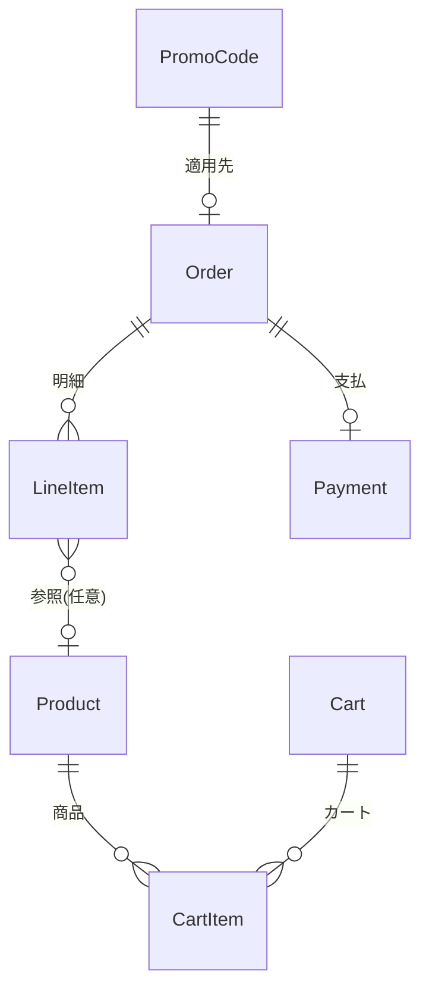

# DB設計・モデル設計 レビュー

## 現状の構成（概要）

```
[product]     Product（商品）
[checkout]    Cart, CartItem（カート）, Icon
[order]       Checkout（注文＝請求情報）, Payment（支払）, LineItem（注文明細）
[promo_code]  PromoCode（クーポン）
[control]     （モデルなし）
```

---

## 良い点

- **明示的な `db_table`** … テーブル名がコードから分かりやすい
- **`verbose_name` の設定** … 管理画面・フォームで分かりやすい
- **LineItem のスナップショット** … 注文時点の商品名・価格を保持しており、履歴として妥当
- **CartItem の UniqueConstraint** … 同一カート内で同じ商品の重複を防いでいる
- **PromoCode のバリデーション** … RegexValidator で形式を制限している

---

## 企業に見せる前に直したい点

### 1. 命名の分かりやすさ

| 現状 | 推奨 | 理由 |
|------|------|------|
| `Checkout` | `Order` | 「Checkout」はプロセス、「Order」は注文という実体。企業では Order が一般的 |
| `Checkout` の `user_name` | `customer_name` など | 認証ユーザーと混同しやすい |
| `Product.context` | `description` | `context` はプログラム用語と紛らわしい |
| `PromoCode.is_used` | `applied_to_order` または `used_by_order` | 中身は Order への FK。名前が役割を表すと分かりやすい |

### 2. セキュリティ（最重要）

- **Payment でカード番号・CVVをそのまま保存している**
  - 実務では **PCI-DSS に抵触** するため、本番では不可。
  - 推奨: Stripe 等の決済代行を使い、**トークンのみ** または **下4桁程度** だけを保存する設計に変更する。
- ポートフォリオとして見せる場合は「決済は外部サービスに委譲し、当システムではトークン／識別子のみ保持」と説明できると良い。

### 3. リレーション・整合性

- **LineItem に Product への参照がない**
  - 現状: 注文時点の名前・価格だけを保持（スナップショットは良い）。
  - 推奨: 分析・「再注文」用に `product = models.ForeignKey(Product, null=True, on_delete=SET_NULL)` を追加すると、企業向けの説明がしやすい。
- **PromoCode と Order の関係**
  - `OneToOne` で「1クーポン＝1注文で1回だけ」を表現しているのは意図が伝わる。フィールド名を `applied_to_order` などにするとさらに分かりやすい。

### 4. その他

- **Product.id** … `AutoField` は通常省略可能。明示してもよいが、Django のデフォルト説明と合わせて「主キーはデフォルト」と書けるとよい。
- **control アプリ** … モデルがなければ「将来の管理用」等、役割を README や設計メモに1行書いておくとよい。
- **Icon** … checkout アプリにあるが、商品やカテゴリと紐づくなら product や共通アプリの方が分かりやすい場合がある。

---

## わかりやすさのためのドキュメント例

企業に見せる場合は、次のような **1ページの図＋説明** があると伝わりやすいです。

### エンティティ関係（文章で表現）

- **Product** … 商品マスタ（code で一意）
- **Cart / CartItem** … 未ログイン含む「買い物かご」。Cart は session_id、CartItem は (cart, product) で一意
- **Order（現 Checkout）** … 1回の注文。住所・合計金額・合計数量・注文日時を持つ
- **LineItem** … 注文明細。注文時点の商品名・単価・数量・小計を保存（Order に多対一）
- **Payment** … 1 Order に1 Payment。※実運用ではカード情報は持たずトークンのみ想定
- **PromoCode** … クーポン。1回使うと `applied_to_order` に Order が入り、二重使用を防止

### 図にする場合（Mermaid 例）



---

## まとめ

- **「このまま企業に見せられる？」**  
  - **命名と「決済情報の扱い」を整理すれば、ポートフォリオとして説明可能**な水準です。
- **「もっとこうした方がいい？」**  
  - 上記のとおり、(1) 命名の統一（Order / description / applied_to_order）、(2) 決済はトークンのみ扱う前提の説明、(3) LineItem と Product の任意の関連、(4) 1ページの ER 説明または図、の4点を入れると「わかりやすさ」と「企業向け」の両方がかなり良くなります。

必要なら、`Order` へのリネーム手順や、`LineItem` に `product` FK を追加するマイグレーション例も書けます。

---

## データの取り出し方の統一感

### 現状のばらつき

| 観点 | 現状 | 問題・推奨 |
|------|------|------------|
| **カートの取得** | `Cart.objects.get(session_id=...)` と `Cart.objects.get_or_create(...)` が用途で混在 | 注文・プロモは `get`（無いと例外）、ヘッダー用は try/except で 0 返却。意図は分かるが「カート必須画面」では `get_object_or_404(Cart, session_id=...)` に揃えると意図が明確になる。 |
| **カートアイテム** | ほぼ `cart_obj.get_items()` で統一されている | ◎ 良い。モデル側で `select_related("product")` しており N+1 も防げている。 |
| **Checkout に紐づくデータ** | `LineItem.objects.filter(checkout=current_checkout)` と `Payment.objects.get(checkout=current_checkout)` で取得（control/views） | 同じ「親に紐づく子」なのに、**親の逆参照**（`current_checkout.lineitem_set.all()`, `current_checkout.payment`）を使っていない。Django では「親オブジェクトから関連を取る」形に揃えると読みやすく、他の画面とも一貫する。 |
| **変数名** | カートを `cart_obj` と `cart` の両方で表記（checkout/views） | 同じ概念は `cart` または `cart_obj` のどちらかに揃えると分かりやすい。 |

### 推奨する統一ルール（わかりやすさ重視）

1. **「親から子を取る」で揃える**  
   Checkout が既にあるときは、`current_checkout.lineitem_set.all()` と `current_checkout.payment` で LineItem・Payment を取得する。`LineItem.objects.filter(checkout=...)` も動くが、**「1つの注文オブジェクトから関連をたどる」** 形にすると流れが追いやすい。

2. **カート必須の画面**  
   注文・プロモ適用など「カートが無いと成り立たない」画面では、`get_object_or_404(Cart, session_id=session_key)` にして「カートが無い＝404」と明示する。

3. **変数名**  
   カートインスタンスは `cart` に統一（または `cart_obj` に統一）し、プロジェクト内でどちらか一方に揃える。

4. **N+1 の意識**  
   現状、`get_items()` で `select_related("product")` しているのは良い。Checkout 一覧で `line_items` や `payment` をテンプレートでループする場合は、その時点で `prefetch_related("lineitem_set")` や `select_related("payment")` を検討する（現在の CustomerList は Checkout のフィールドのみなら不要）。

### 修正例（control/views の CustomerDetails）

```python
# 修正前
context["line_items"] = LineItem.objects.filter(checkout=current_checkout)
context["payment_info"] = Payment.objects.get(checkout=current_checkout)

# 修正後（親から関連を取る）
context["line_items"] = current_checkout.lineitem_set.all()
context["payment_info"] = current_checkout.payment
```

※ `Payment` は Checkout に OneToOne で紐づいているため、`current_checkout.payment` で取得できる。LineItem は逆参照のデフォルト名 `lineitem_set` で取得。`related_name` を付けて `order.line_items` のようにしたければ、モデルで `LineItem` の `ForeignKey` に `related_name="line_items"` を指定するとよい。
